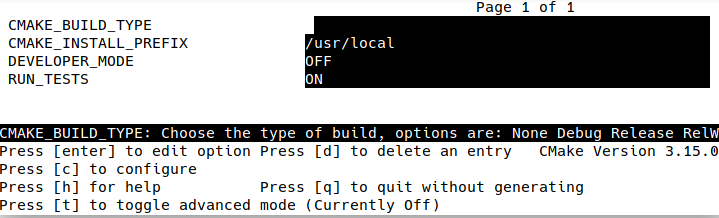
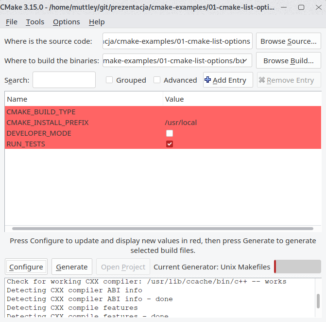

class: title-slide

# Basic usage as user

---

# Basic usage as user - generating and building

--

## Generating Makefile/Visual Studio solution

.left-column[
```
cd ~/git/repository
mkdir build
cd build
cmake .. -DCMAKE_BUILD_TYPE=Debug
```

## Starting the build

```
cmake --build .
```

or

```
make
```
]

--

.right-column[
.info[
.center[
_NEVER_, simply _NEVER_ do in-source builds.

Always create a build sub-directory or do out-of-source builds.


CMake generates its files in current working directory.
]
]
]

---

# Basic usage as user - parameters

- Passing flags to CMake:

  ```
  cmake .. -DCMAKE_CXX_FLAGS="-fsanitize=address"
  ```

- Generic:

  ```
  cmake .. -DCMAKE_<LANG>_FLAGS="<FLAGS>"
  ```

.info[
_Useful parameters_:
```cmake
CMAKE_BUILD_TYPE       # Debug|Release|MinSizeRel|RelWithDebInfo
CMAKE_CXX_COMPILER     # g++, clang++, ?
CMAKE_EXE_LINKER_FLAGS # -static-libstdc++
```
]

---

# Basic usage as user - setting options

## Setting options
  ```
  cmake .. -DBUILD_STATIC=ON 
  ```

--

## How do I know what options are there?

--

  ```
  cmake -LH ..            # CLI
  cmake .. && ccmake .    # curses-based UI
  cmake-gui ..            # GUI
  ```

---

# Basic usage as user - list options - CLI

_../CMakeLists.txt_

```cmake
cmake_minimum_required(VERSION 3.1)
project(cmake_example_01)
option(RUN_TESTS "Build tests with GoogleTest" ON)
option(DEVELOPER_MODE "Enable checks useful to developers" OFF)
```

_in build directory_

```
$ cmake -LH ..
# <clobber>
// Enable checks useful to developers
DEVELOPER_MODE:BOOL=OFF

// Build tests with GoogleTest
RUN_TESTS:BOOL=ON
```

---

# Basic usage as user - list options - ccmake

```
$ ccmake ..
```

.center[

]

---

# Basic usage as user - list options - cmake-gui

```
$ cmake-gui
```

.center[

]

---
