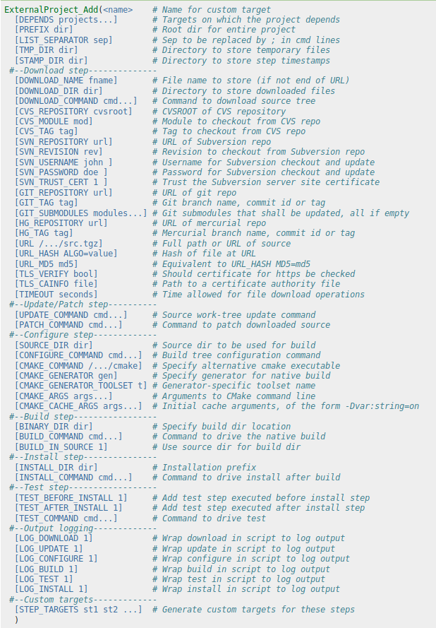

class: title-slide

# Modern CMake

## What's the fuss about?

---

# _Modern CMake_

--

## What is the big change of _CMake 3_?

--

## Target-based approach

--

## Still _everything is a string_, but at least those strings are hidden behind targets. This allows for more object-oriented buildsystem generation.

---

# _Modern CMake_

## How to write modern CMake?

--

- Use targets and their properties
- Use access modifiers
- Do not use global variables
- _AVOID_ FILE(_GLOB_ ...)
- Use target aliases
- Obtain your dependencies in a consistent & maintainable way

---

# Modern CMake - _use targets and their properties_

## _CMake 3.0_* introduced new alternatives to functions related to _including_ and _linking_ libraries

--

.left-column[
_CMake 2.8_

```cmake
add_library(lib1 SHARED lib1.cpp)
include_directories(lib1/include)
link_directories(lib1/lib)
# (lib2 .. lib19)
add_library(lib20 SHARED lib20.cpp)
include_directories(lib20/include)
link_directories(lib20/lib)

add_executable(main main.cpp)
target_link_libraries(main lib1)
```

```
g++ -Ilib1/include -Ilib2/include -Ilib3/include -Ilib4/include -Ilib5/include -Ilib6/include -Ilib7/include -Ilib8/include -Ilib9/include -Ilib10/include -Ilib11/include -Ilib12/include -Ilib13/include -Ilib14/include -Ilib15/include -Ilib16/include -Ilib17/include -Ilib18/include -Ilib19/include -Ilib20/include -Llib1/lib -Llib2/lib -Llib3/lib -Llib4/lib -Llib5/lib -Llib6/lib -Llib7/lib -Llib8/lib -Llib9/lib -Llib10/lib -Llib11/lib -Llib12/lib -Llib13/lib -Llib14/lib -Llib15/lib -Llib16/lib -Llib17/lib -Llib18/lib -Llib19/lib -Llib20/lib -llib1 main.cpp
```
]

--

.right-column[
_CMake 3_

```cmake
add_library(lib1 SHARED lib1.cpp)
target_include_directories(lib1 PUBLIC lib1/include)
target_link_directories(lib1 PUBLIC lib1/lib)
# (lib2 .. lib19)
add_library(lib20 SHARED lib20.cpp)
target_include_directories(lib20 PUBLIC lib20/include)
target_link_directories(lib20 PUBLIC lib20/lib)

add_executable(main main.cpp)
target_link_libraries(main PRIVATE lib1)
```

```
g++ -Ilib1/include -Llib1/lib -llib1 main.cpp
```
]

---

# Modern CMake - _Access modifiers_

--

## Used with functions starting with _target__

--

- PRIVATE
- INTERFACE
- PUBLIC

--

.info[
.center[
Access modifiers mainly impact _target_link_libraries_ function
]
]

---

# Modern CMake - Access modifiers - _PRIVATE, INTERFACE, PUBLIC_

--

.left-column[
```cmake
add_library(lib1 STATIC lib1.cpp)
target_include_directories(lib1 PRIVATE
                           external/lib/include)

add_executable(main main.cpp)
target_link_libraries(main PRIVATE lib1)
```

```
g++ lib1.cpp -Iexternal/lib/include
g++ main.cpp -l(...)/build/lib1.a
```
]

--

.right-column[
```cmake
add_library(lib1 STATIC lib1.cpp)
target_include_directories(lib1 INTERFACE
                           external/lib/include)

add_executable(main main.cpp)
target_link_libraries(main PRIVATE lib1)
```

```
g++ lib1.cpp
g++ main.cpp -Iexternal/lib/include \
             -l(...)/build/lib1.a
```
]

--

<br/><br/><br/><br/><br/><br/><br/><br/>

```cmake
add_library(lib1 STATIC lib1.cpp)
target_include_directories(lib1 PUBLIC external/lib/include)

add_executable(main main.cpp)
target_link_libraries(main PRIVATE lib1)

g++ lib1.cpp -Iexternal/lib/include
g++ main.cpp -Iexternal/lib/include -l(...)/build/lib1.a
```

---

# Modern CMake - _Avoiding global variables_

--

## We can't avoid using global variables in CMake, but at least we can minimize their usage count.

--

.info[
Global variables could be an easy source of mistakes.
]

---

# Modern CMake - _Avoiding global variables_

--

If we would want to enable warnings on GCC compiler, we would use _-Wall_ flag for that

--

Simple attempt would be:
```cmake
set(CMAKE_CXX_FLAGS "-Wall")
```

--

## What is the problem with that call?
--

## It will discard all user provided flags

```cmake
cmake .. -DCMAKE_CXX_FLAGS="-fsanitize=address"
```

---

# Modern CMake - _Avoiding global variables_

## How can we solve it?

--

- Good

```cmake
set(CMAKE_CXX_FLAGS "${CMAKE_CXX_FLAGS} -Wall")
```

--

- Better

```cmake
string(APPEND CMAKE_CXX_FLAGS " -Wall")
```

--

- The best

```cmake
target_compile_options(main PRIVATE "-Wall")
```

---

# Modern CMake - _AVOID FILE(GLOB ...)_

--

```cmake
file(GLOB SOURCES src/*.cpp)
```

--

```
$ ls src/
main.cpp lib1.cpp
$ mkdir build; cd build
$ cmake .. # SOURCES == main.cpp, lib1.cpp
$ echo "<somecode>" >lib2.cpp
$ make
```

--

## _main.cpp_ and _lib1.cpp_ will get compiled, _lib2.cpp_ will be left out

.info[
To regenerate CMake's GLOB cache run:
```cmake
make rebuild_cache
```
]

---

# Modern CMake - _Use target aliases_

--

## Target alias allows you to give imported library sanitized name.

--

## Many of CMake modules do not follow any convention regarding naming imported libraries.

--

```cmake
find_package(SomeGUILib)
target_link_libraries(main PRIVATE SomeGUI::Widgets SomeGUI::Network)
```

```cmake
find_package(OtherLib)
target_link_libraries(main PRIVATE other_lib_main other_lib)
```

--

## Solution?

--

```cmake
add_library(Other::Lib ALIAS other_lib)
```

---

# Modern CMake - _Obtaining dependencies_

## What are our options?

--

- Have them installed in system (_Docker_/_VM_/_Yocto_)

--

- Included in repository - subdirectory/_git submodule_

--

- _ExternalProject_Add_

--

- _conan_, _hunter_, _vcpkg_ and others - package managers

---

# Modern CMake - Obtaining dependencies - _Submodule_

```
$ git submodule add https://github.com/google/googletest.git
```

```cmake
add_subdirectory(googletest EXCLUDE_FROM_ALL)
```

## Pros:

- No additional dependencies

## Cons:

- They take up space in your repository (subdirectory)
- Nested submodules can result in unmaintainable mess
- Vulnerable to CMake-clutter (ex. oktal/pistache leaks cppcheck)

---

# Modern CMake - Obtaining dependencies - _ExternalProject_

--

## Pros:

- relatively simple
- no additional dependencies (if we’re using CMake already)
- versatile (can get our dependency from CVS, SVN, Git, Mecurial, zip, tar and probably others)
- CMake-clutter proof

--

## Cons:

- requires CMake-Fu
- a lot of lines to set anything up

---

# Modern CMake - Obtaining dependencies - _ExternalProject_

.left-column[
## CMake-Fu ?

- 53 optional parameters
- workarounds will be required:
    - [HTTP_PROXY on Windows](https://github.com/pmem/pmdk-tests/blob/master/functions.cmake#L51)
]

.right-column[

]

---

# Modern CMake - Obtaining dependencies - _ExternalProject_

.small[
```cmake
function(download_gtest)
	include(ExternalProject)
	set(GTEST_VERSION 1.8.0)
	set(GTEST_SHA256HASH f3ed3b58511efd272eb074a3a6d6fb79d7c2e6a0e374323d1e6bcbcc1ef141bf)
	
	set(GTEST_URL https://github.com/google/googletest/archive/release-${GTEST_VERSION}.zip)
	
	ExternalProject_Add(
	    gtest
	    URL ${GTEST_URL}
	    URL_HASH SHA256=${GTEST_SHA256HASH}
	    DOWNLOAD_NAME googletest-${GTEST_VERSION}.zip
	    DOWNLOAD_DIR ${CMAKE_SOURCE_DIR}/external/gtest
	    PREFIX ${CMAKE_CURRENT_BINARY_DIR}/external/gtest
	    LOG_INSTALL 0
	    INSTALL_COMMAND ""
	    CMAKE_ARGS -DCMAKE_C_COMPILER=${CMAKE_C_COMPILER} -DCMAKE_CXX_COMPILER=${CMAKE_CXX_COMPILER} -DCMAKE_CXX_FLAGS="-Wno-deprecated-copy"
	)
	
	# CMake is beautiful - https://gitlab.kitware.com/cmake/cmake/issues/15052
	file(MAKE_DIRECTORY "${CMAKE_CURRENT_BINARY_DIR}/external/gtest/src/gtest/googletest/include")
	
	add_library(libgtest STATIC IMPORTED GLOBAL)
	target_include_directories(libgtest SYSTEM INTERFACE "${CMAKE_CURRENT_BINARY_DIR}/external/gtest/src/gtest/googletest/include")
	target_link_libraries(libgtest INTERFACE pthread)
	set_target_properties(libgtest PROPERTIES
	                      IMPORTED_LOCATION "${CMAKE_CURRENT_BINARY_DIR}/external/gtest/src/gtest-build/googlemock/gtest/libgtest.a")
	
	add_library(libgtest_main STATIC IMPORTED GLOBAL)
	target_include_directories(libgtest_main SYSTEM INTERFACE "${CMAKE_CURRENT_BINARY_DIR}/external/gtest/src/gtest/googletest/include")
	target_link_libraries(libgtest INTERFACE pthread)
	set_target_properties(libgtest_main PROPERTIES
	                      IMPORTED_LOCATION "${CMAKE_CURRENT_BINARY_DIR}/external/gtest/src/gtest-build/googlemock/gtest/libgtest_main.a")
	
	add_dependencies(libgtest gtest)
	add_dependencies(libgtest_main gtest)
endfunction()
```
]

---

# Modern CMake - Obtaining dependencies - _Package managers_

--

## Pros:

- simplest to use when they are working
- may have prebuilt packages

--

## Cons:

- will there be package X?
- external dependencies (ex. Python)

---

# Obtaining dependencies - _Package managers_ - _Conan_

## Better described at Wro.cpp #10

--

```
pip install conan
conan search "gtest*" --remote=conan-center
optional: conan inspect <package>
create conanfile.txt
  [requires]
  gtest/1.8.1@bincrafters/stable
  [generators]
  cmake
mkdir build && cd build
conan install .. [--build gtest]
```

--

```cmake
include(${CMAKE_BINARY_DIR}/conanbuildinfo.cmake)
conan_basic_setup(TARGETS TRUE) # Important for Modern CMake

target_link_libraries(tests PRIVATE CONAN_PKG::gtest)
```

---

# Obtaining dependencies - _Package managers_ - _Conan_

--

## Conan isn’t exactly modern CMake:

--

- Disturbs ‘standard’ flow of using CMake – you need to call _conan install_ first

--

- Exports a lot of global variables

--

- Modifies global variables (so using _Conan_ can change our build flags)

--

- Default uses variables instead of targets (_${CONAN_LIBS}_ instead of _CONAN_PKG::gtest_)

--

- Creating profiles for other compiles isn't exactly simple, but it's supported

---

# Obtaining dependencies - _Package managers_ - _Hunter_

- Download HunterGate.cmake to your project

```cmake
cmake_minimum_required(VERSION 3.1)

include(HunterGate.cmake)

HunterGate(
    URL "https://github.com/cpp-pm/hunter/archive/v0.23.222.tar.gz"
    SHA1 "0b88baaa2a9a35b8ce632c57ade66be8dd918afd"
)

project(hunter-test)

include(hunter_cmake_args)
hunter_add_package(GTest)
find_package(GTest CONFIG REQUIRED)

add_executable(main main.cpp)
target_link_libraries(main PRIVATE GTest::gtest GTest::main)
```

---

# Obtaining dependencies - _Package managers_ - _Hunter_

## Pros:

- modern, beautiful, short
- no external dependencies
- can do what ExternalProject does

--

## Cons:

- it doesn't work...
--
  but seriously, it's so modern, that it is unhackable
- maintainer problems: [#1921](https://github.com/ruslo/hunter/issues/1921)

---

# Obtaining dependencies - _Package managers_ - _vcpkg_

--

- Install vcpkg

```
vcpkg install gtest
```

--

- Add code to CMakeLists.txt

```cmake
find_package(GTest MODULE REQUIRED)
target_link_libraries(main PRIVATE GTest::GTest GTest::Main)
```

--

- Call CMake:

```
cmake .. -DCMAKE_TOOLCHAIN_FILE=/usr/share/vcpkg/scripts/buildsystems/vcpkg.cmake
```

---

# Obtaining dependencies - _Package managers_ - _vcpkg_

--

## Pros:

- Clean and modern
- Probably least painful from all I tested

--

## Cons:

- needs some kind of profile-environment

---
