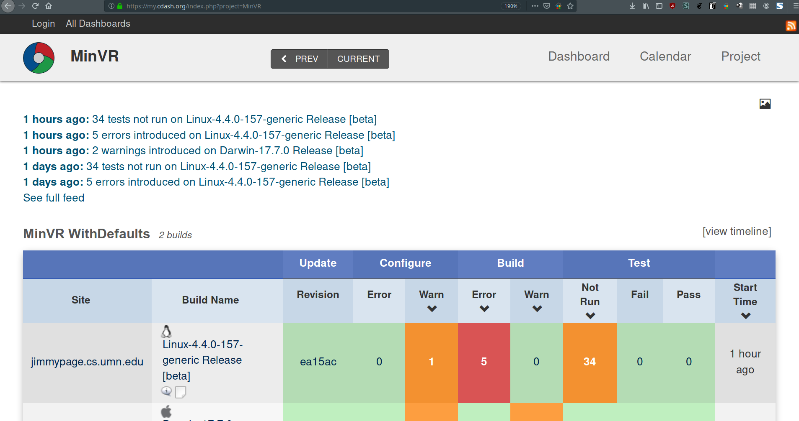
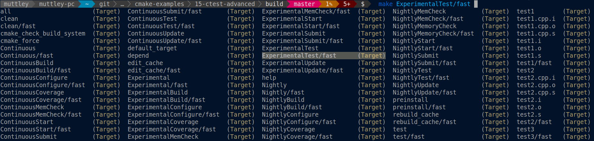

class: title-slide

# CTest && CPack

---

# _CTest_

--

## CTest is CMake’s integrated test runner

- Two ways to use, basic (without module):

--

```cmake
enable_testing() #You have to call it in every directory
add_test(<TEST_NAME> <BINARY_NAME> [<ARGS>])
```

--

```
ctest [-V] [--output-on-failure]
```

## or

```
make test
```

---

# _CTest advanced mode_

--

.left-column[
```cmake
include(CTest)
add_test(<TEST_NAME> <BINARY_NAME> [<ARGS>])
```

## Main selling point is CDash support
]

--

.right-column[

]

---

# _CTest advanced mode_

--

- Exports a bunch of targets, which propagate through _add_subdirectory_



--

- Supports 'advanced pipelines' through scripts

--

- Can run your tests with Valgrind without any additional setup

--

- 2010 CI feeling

---

# _CPack_

--

## _CPack_ allows you to create cross-platform installer for your program

--

## It can output various installers and packages, ex. _DEB_, _STGZ_ (self extracting SH), _NSIS_ (.exe installer), _RPM_, _ZIP_,_TGZ_

---

# _CPack_ - code example

--

```cmake
cmake_minimum_required(VERSION 3.1)
project(cpack-example)

add_library(lib STATIC src/lib.cpp src/lib.hpp)
add_executable(main src/main.cpp)
target_link_libraries(main PRIVATE lib)

install(TARGETS main DESTINATION bin)

set(CPACK_PACKAGE_VERSION_MAJOR "1")
set(CPACK_PACKAGE_VERSION_MINOR "0")
set(CPACK_PACKAGE_VERSION_PATCH "0")
set(CPACK_PACKAGE_CONTACT "some contact")

include(CPack)
```

--

```
cmake .. -DCPACK_GENERATOR=STGZ
make
make package
```

---
